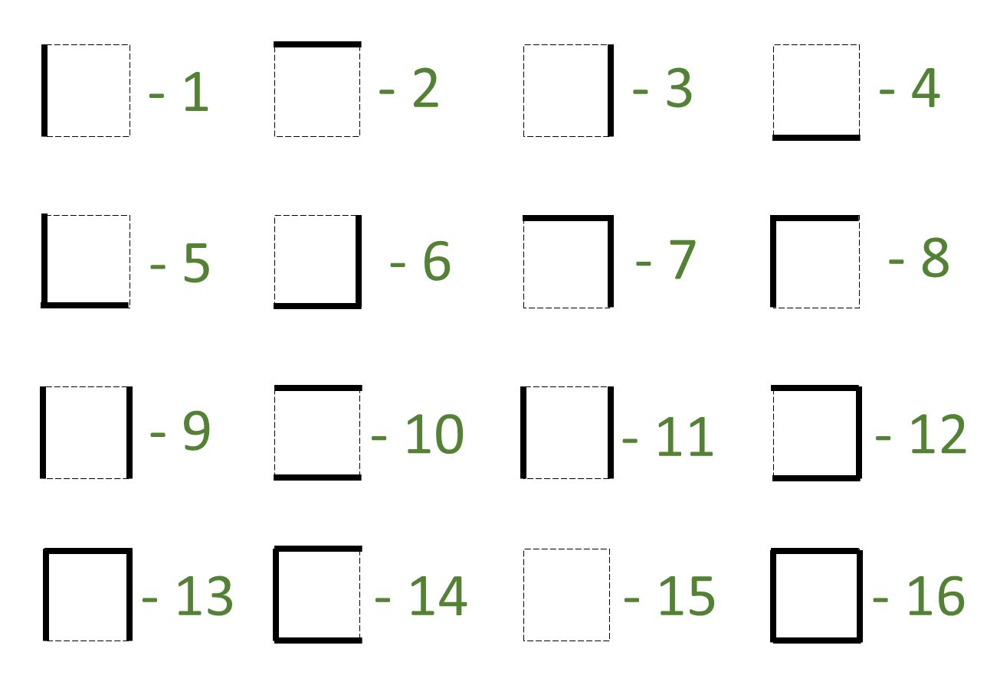

This part goes into the micromouse microcontroller to make real-time
 decisions and communicate with the user interface via bluetooth.

As the mouse traverses through the maze, it can detect if a walls present to the left, right or in front of it, with the use of it’s distance sensors. Next, depending on the availability of a wall to the left, right or front of the mouse, and the mouse’s orientation while in the cell, we updated the corresponding entry in the maze array by its wall configuration.

These 16 combinations were also categorized according to the presence of a wall to the left, right, up and down in a square.

## The FloodFill algorithm
 
 Imagine you pour water into the destination of the maze( which is the four center cells surrounded by 7 walls). The water will first flow to the cell immediately outside the destination cells. And then to it’s immediately accessible neighboring cells. Similarly, water will flow along the paths in the maze, eventually reaching the starting position of the mouse.

We define another 16*16 maze, lets call it the Flood array. Inspired by the water pouring example, we assigned zero to the four destination cells, 1 to the cell which is immediately accessible by the destination cells, and so on. The cells to which the water flows last will get the highest number.

If you place your mouse anywhere in the maze, and ask it to travel to the cell with the value 1 less than the value of the cell it is in, the mouse is guaranteed to eventually make it to the destination in the path will minimum number of cells.

1. Finds the values of it’s neighboring cells (from the flood array)
2. Travels to the neighboring cell with the least value
3. Detects the walls to its left, right and the front
4. Updates the newly found walls in the maze array
5. Perform the flood fill for the entire flood array
6. Back to step 1, and continue until the robot moves to the desired position.

If you want to send the mouse to some other cell (not to one of the middle four), all you have to do is, perform the floodfill from your desired cell. ie, start by putting zero to the cell you expect the mouse to travel to.

## The fast run

Once you decide that the mouse has discovered enough cells to find an optimum path, you can bring the mouse back to the starting square, and do the fast run. In the process, the mouse.

1. Finds the values of it’s neighboring cells (from the flood array)
2. Travels to the neighboring cell with the value 1 less than the present cell
3. Back to step 1, and continue until the robot moves to the desired position

During the fast run, we don’t need to update the maze array or the flood array as the mouse will only be moving to the cells that are already discovered.